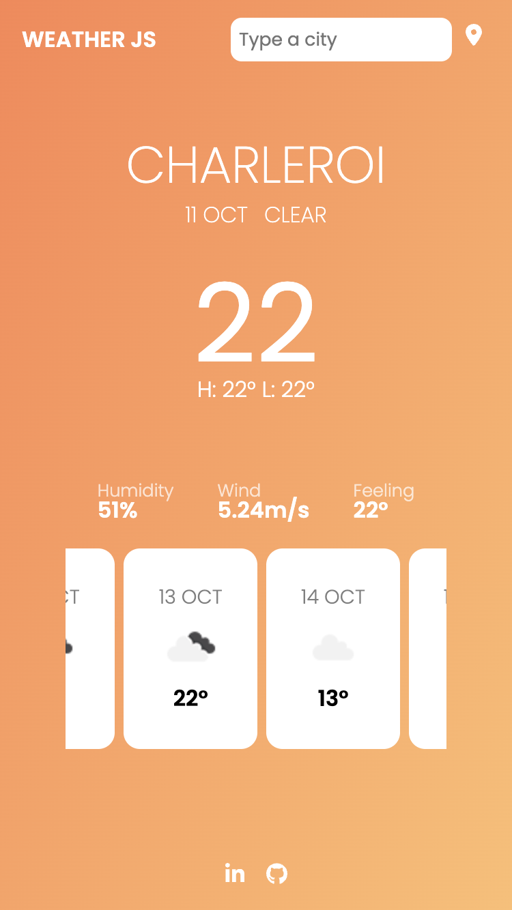
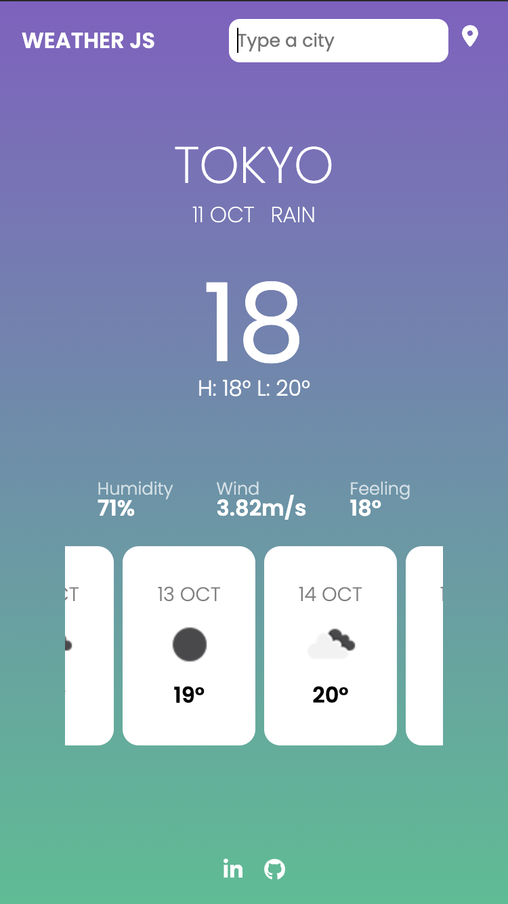

# Weather App

## About the project

This is a weather app built with `Vanilla JS` and designed with `SCSS`.

[Go to the app !](https://weather-app-five-orpin-51.vercel.app/)

### Interesting features

- Dynamic color gradient based on the current weather
- Designed `mobile first` /w `desktop UI`
- Weather previsions for 5 days

### Built with

[OpenWeatherAPI](https://openweathermap.org/api)

## Preview

## Contact

Antoine LANSMAN - antoine.lansman@gmail.com
